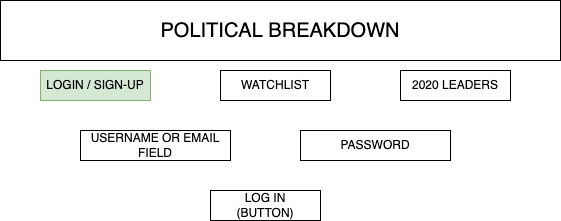
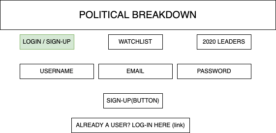
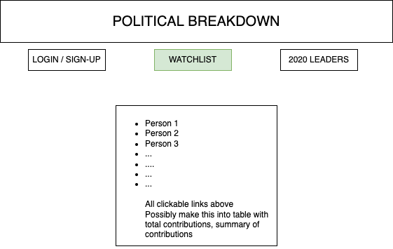
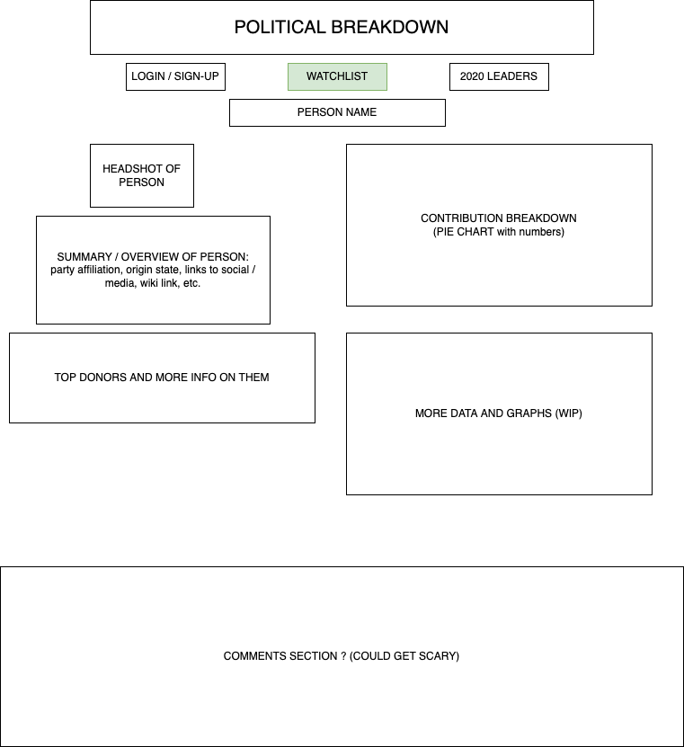
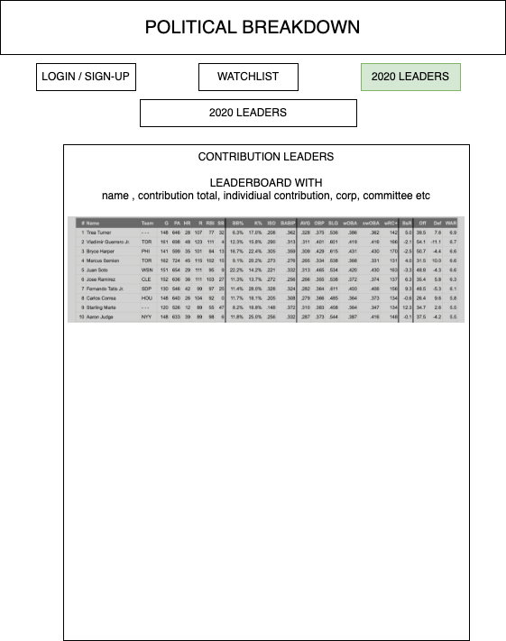
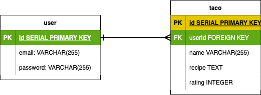

# Political Breakdown

## USER STORIES

As a user, I want to:

- Create or edit a watchlist political officials by:
  - Entering my address (ideally just zipcode, working on this...) and populating the list with local representatives with an option for higher offices AND/OR
  - Typing in an incumbent official and adding it to the list
  - Clicking 'DELETE' or 'ADD' to perform the respective action on the list
- Go to my profile (user) page and view my watchlist
- Click on official's name to go to a breakdown page of the candidate
  - View their stock portfolio, stock transactions
  - More information on the candiate (party, wiki link, link to their socials and their website, ...) 

## WIREFRAMEs (WIP)

### NOTE: REPLACE 'CONTRIBUTIONS' WITH 'STOCKS' IN THE WIREFRAMES BELOW

### WELCOME PAGE

### LOGIN PAGE

### SIGN-UP PAGE

### WATCHLIST PAGE

### DETAILED OFFICIAL PAGE

### LEADERBOARD

## BACKGROUND

Ever wonder who's contributing to the really hip and cool politicians?? Well look no further than the Politcal Breakdown web app!

Track what stocks your favorite local and federal politicians are trading! Add and delete from your watchlist to track those devious officials who are definitely voting with our best interests in mind!

A leaderboard page summarizes who has the most contributions and by which category.

## DEVELOPMENT

### ROUTES

|HTTP VERB|ROUTE                    |ACTION|USED FOR                     |
|---------|-------------------------|------|---------------------------- |
|GET      |'/login'                 |index |accessing log-in page        |
|GET      |'/signup'                |index |accessing sign-up page       | 
|GET      |'user/:id/watchlist'     |index |accessing watchlist page     |
|GET      |'/leaderboard'           |index |accessing leaderboard page   |
|GET      |'/:fedofficialid'        |index |accessing person page        |
|POST     |'/user/:id/watchlist/new'|create|add person to watchlist      |
|DELETE   |'/user/:id/watchlist'    |delete|remove person from watchlist |
|PUT      |'/user/:id/watchlist'    |update|replace person in watchlist  |

### ERD

### APIs and other TECHNOLOGY

To find representatives and senators from a user's state, Google's Civic Information API will be used.

To track stock transaction of the officials, Quiver API will be used. Shoutout ot QuiverQuant!

To get background information on the officials, Wikiepedia API will be used. Shoutout to Wikipedia! Consider donating if you haven't already.

Plotly.js to make charts, graphs, and other cool views of data.

### MVP

- Create login, signup, logout pages for users.
- Create editable watchlist for users that will track officials.
- Detailed stock transaction page with info on official

### STRETCH

- Create editable watchlist for users that will track stocks
- Detailed stock page with which officials own stocks and transaction history of stock
- Leaderboards page with who has made the most trades and other cool stats
- Cool dashboard page with quick info and stats

