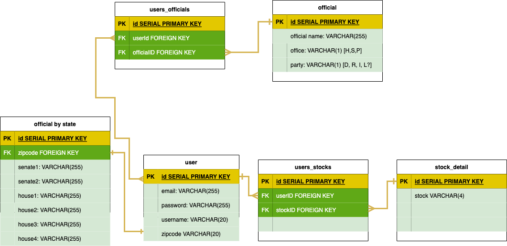

# Political Breakdown

## INSTALL INSTRUCTIONS

- Fork and clone the code, run `npm i`
- Run `createdb project2` for non-WSL
  - For WSL, run `create database project2`
- Run `sequelize db:migrate`
- There are two API keys required:
  - Quiverquant API key: request access at https://api.quiverquant.com/
    - The .env variable name is: QUIV_API_KEY
  - Openstates.org API key: request access at https://openstates.org/accounts/login/?next=/accounts/profile/#apikey
    - The .env variable name is: OPEN_API_KEY
- Create a .env file and copy the keys into the file. Follow the .env format
- Refer to https://www.npmjs.com/package/dotenv for more info
  - In the .js files, refer to the .env keys as shown in the example below
    - process.env.QUIV_API_KEY

## DEPLOYMENT LINK

https://political-breakdown.herokuapp.com/

## USER STORIES

As a user, I want to:

- Create or edit a watchlist of stocks by:
  - Typing in a search term and adding it to the list
  - Clicking 'DELETE' or 'ADD' to perform the respective action on the list
- Go to my profile (user) page and view my watchlist
- Click on stock's name to go to a breakdown page of the stock
  - View stock transactions by different elected officials

## WIREFRAMEs (WIP)

### NOTE: REPLACE 'CONTRIBUTIONS' WITH 'STOCKS' IN THE WIREFRAMES BELOW

### WELCOME PAGE

### LOGIN PAGE

### SIGN-UP PAGE

### WATCHLIST PAGE

### DETAILED OFFICIAL PAGE

### LEADERBOARD

## BACKGROUND

Ever wonder what stocks our really hip and cool politicians are trading?? Well look no further than the Politcal Breakdown web app!

Track what stocks your favorite local and federal politicians are trading! Add and delete from your watchlist to track stock transactions our devious officials (who are definitely voting with our best interests in mind) are making!

## DEVELOPMENT

### ROUTES

| HTTP VERB | ROUTE                     | ACTION | USED FOR                        |
| --------- | ------------------------- | ------ | ------------------------------- |
| GET       | '/login'                  | index  | accessing log-in page           |
| GET       | '/signup'                 | index  | accessing sign-up page          |
| GET       | 'users/watchlist'         | index  | accessing watchlist page        |
| GET       | '/officials'              | index  | accessing officials search page |
| GET       | '/officials/:name'        | index  | accessing official page         |
| GET       | '/stocks/:symbol'         | index  | accessing stock page            |
| GET       | '/stocks'                 | index  | accessing stock search page     |
| POST      | '/officials/add'          | create | add person to watchlist         |
| POST      | '/stocks/add'             | create | add stock to watchlist          |
| DELETE    | '/officials/:name/delete' | delete | remove person from watchlist    |
| DELETE    | '/stocks/:symbol/delete'  | delete | remove stock from watchlist     |
| PUT       | '/users/profile/changepw' | update | change user's password          |

### ERD

### APIs and other TECHNOLOGY

To track stock transaction of the officials, Quiver API will be used. Shoutout ot QuiverQuant!

To get background information on the officials, Wikiepedia API will be used. Shoutout to Wikipedia! Consider donating if you haven't already.

Plotly.js to make charts, graphs, and other cool views of data.

### MVP

- Create login, signup, logout pages for users.
- Create editable watchlist for users that will track stocks and officials.
- Detailed stock page with what elected officials traded the stock

### STRETCH

- Detailed stock page with which officials own stocks and transaction history of stock
- Detailed stock page with graphs and other visualizations
- Leaderboards page with who has made the most trades and other cool stats
- Cool dashboard page with quick info and stats
